# Terraform IaC Extension Pack

This pack includes [Terraform](https://www.terraform.io/) helpful extensions for working as a DevOps engineer.

## List of Extensions

- <https://marketplace.visualstudio.com/items?itemName=aaron-bond.better-comments>
- <https://marketplace.visualstudio.com/items?itemName=alefragnani.Bookmarks>
- <https://marketplace.visualstudio.com/items?itemName=alefragnani.project-manager>
- <https://marketplace.visualstudio.com/items?itemName=bin3377.iam-policy>
- <https://marketplace.visualstudio.com/items?itemName=Bridgecrew.checkov>
- <https://marketplace.visualstudio.com/items?itemName=codezombiech.gitignore>
- <https://marketplace.visualstudio.com/items?itemName=CoenraadS.bracket-pair-colorizer-2>
- <https://marketplace.visualstudio.com/items?itemName=Gruntfuggly.todo-tree>
- <https://marketplace.visualstudio.com/items?itemName=hashicorp.terraform>
- <https://marketplace.visualstudio.com/items?itemName=mgtrrz.terraform-completer>
- <https://marketplace.visualstudio.com/items?itemName=oderwat.indent-rainbow>
- <https://marketplace.visualstudio.com/items?itemName=mhmdio.terraform-extension-pack>
- <https://marketplace.visualstudio.com/items?itemName=ShiftLeftSecurity.shiftleft-scan>
- <https://marketplace.visualstudio.com/items?itemName=SteefH.terraform-documentation-links>

## Screenshots

### better-comments

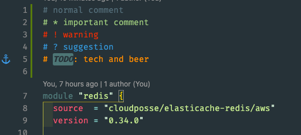

### bookmarks

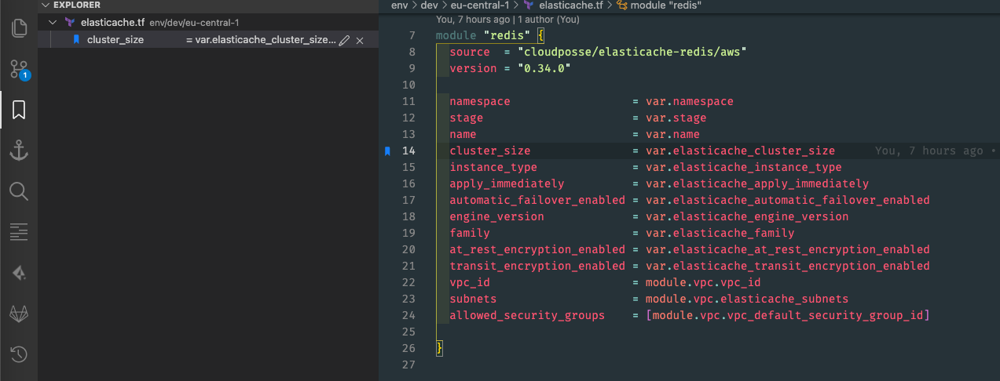

### bracket-pair-colorizer-2

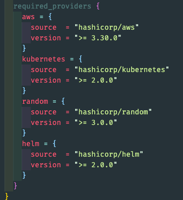

### checkov

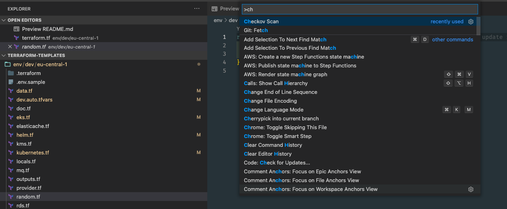

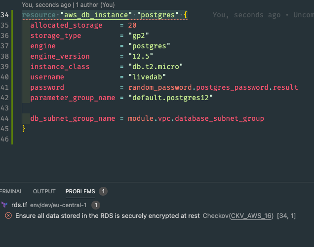

### gitignore

### iam-policy

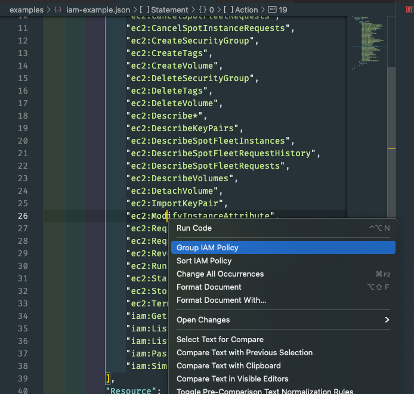

### indent-rainbow

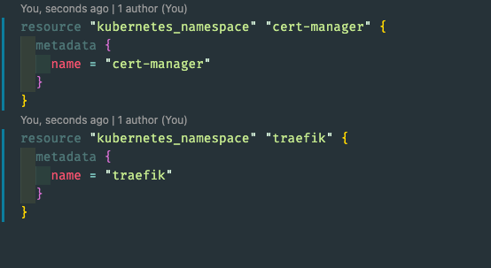

### project-manager

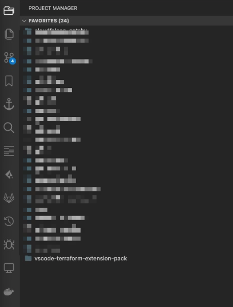

### terraform-completer

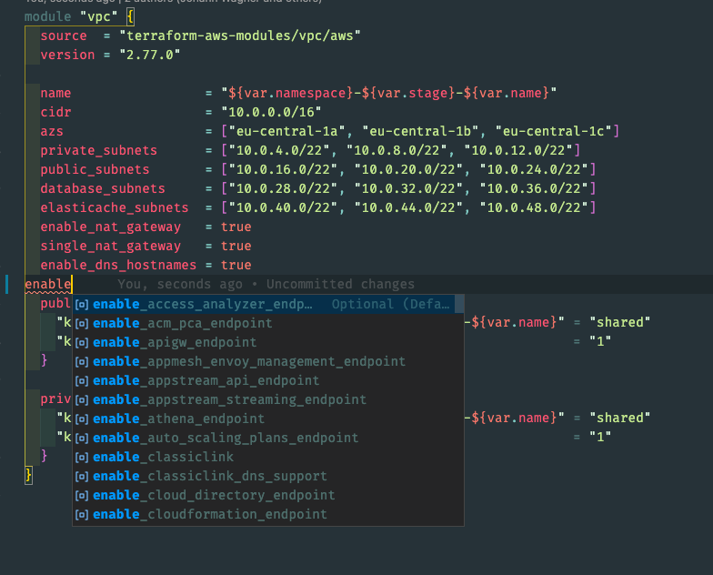

### terraform-doc-snippets

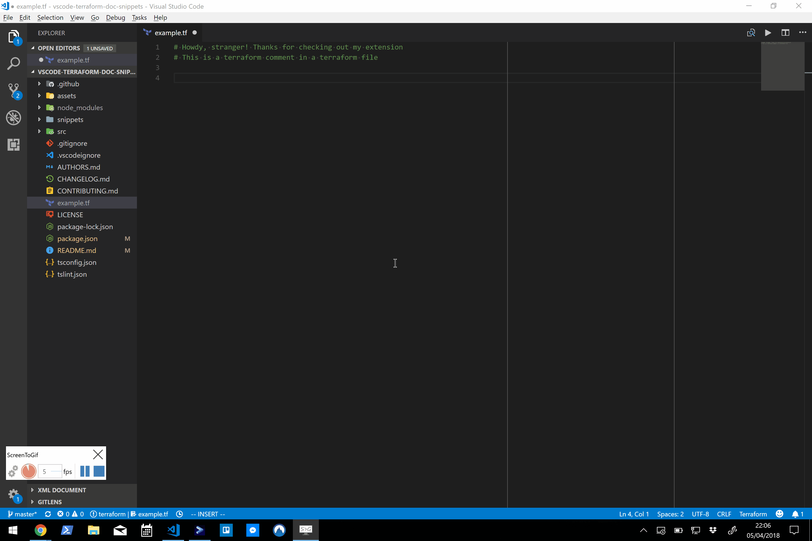

### terraform-documentation-links

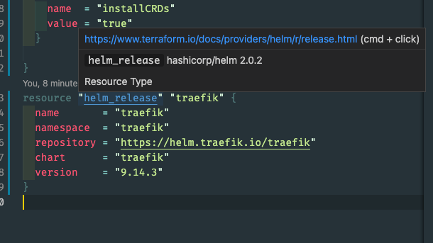

### terraform

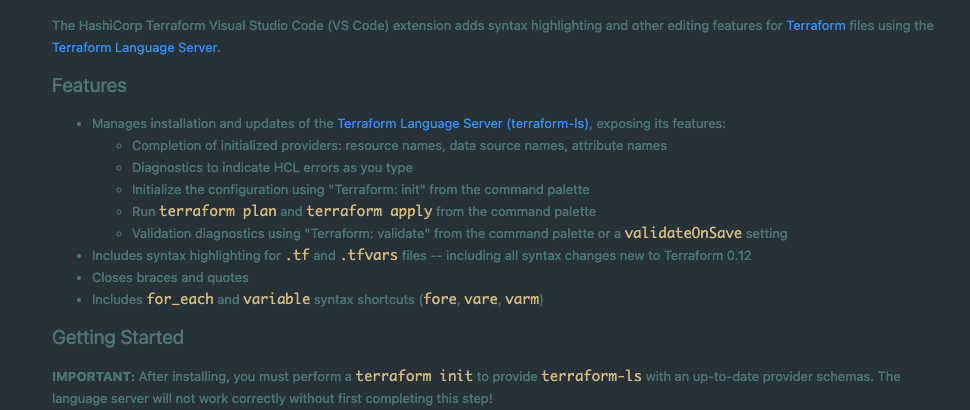

### todo-tree

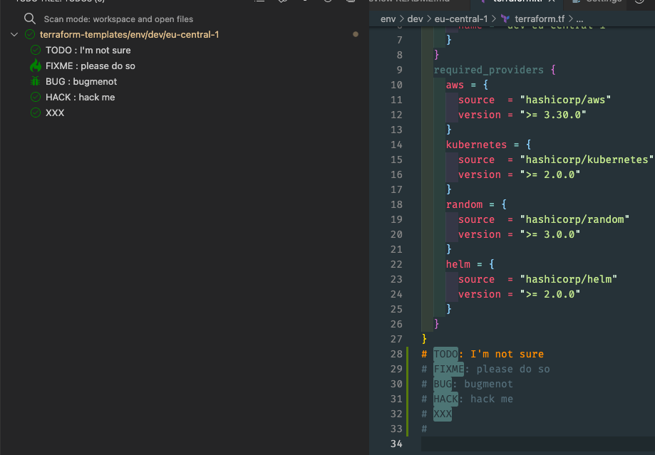

### shiftleft-scan

N/A
